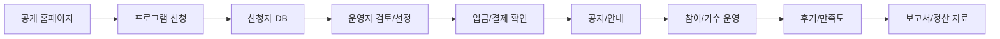

# NUVIO PRD

작성일: 2026-05-09
상태: Working PRD
제품명: NUVIO

## 1. 한 줄 정의

NUVIO는 로컬 체류 프로그램 운영자를 위한 공개 모집 홈페이지 네트워크이자 신청자 운영 SaaS입니다.

## 2. 제품 판단

NUVIO는 일반 여행객이 지역축제, 관광지, 행사 정보를 검색하는 서비스가 아닙니다. 그런 메뉴는 있으면 좋아 보이지만 타겟이 흐려지고, 실제 구매 이유와 멀어집니다.

핵심 고객은 마을/청년마을/로컬 프로그램 운영자입니다. 이들은 예쁜 홈페이지보다 신청자 관리, 기수 운영, 입금 확인, 공지, 후기 수집, 보고서 작성이 더 절실합니다.

따라서 공개 홈페이지는 독립 목적이 아니라 운영 SaaS의 바깥쪽 화면입니다.

## 3. 배경

현재 로컬 체류 프로그램 운영은 여러 도구에 흩어져 있습니다.

- 홍보: 인스타그램, 임시 홈페이지, 블로그
- 신청: 구글폼, 네이버폼, 전화/문자
- 선정: 엑셀, 수기 메모
- 입금: 계좌 내역 수동 확인
- 공지: 개인 문자, 단체 카카오톡방
- 후기: 카카오톡, 구글폼, 인스타 태그
- 보고서: 운영 후 다시 엑셀/문서로 재가공

이 구조에서는 운영자가 매 기수마다 같은 일을 반복합니다. 신청자는 본인이 어떤 정보를 제출했는지, 선정 이후 무엇을 해야 하는지 찾기 어렵습니다.

## 4. 목표

### Product Goals

1. 운영자가 개발자 없이 마을 홈페이지와 프로그램 신청 페이지를 만들 수 있다.
2. 참가자는 프로그램을 보고, 신청하고, 이후 안내와 신청 이력을 확인할 수 있다.
3. 운영자는 신청자 상태, 기수, 입금, 공지, 후기, 보고서 자료를 한 흐름에서 관리할 수 있다.
4. 보성 전체차LAB 사례를 기준 템플릿으로 만들고 다른 마을에 복제할 수 있다.
5. 외부 공고 수집은 공개 노출이 아니라 운영자/NUVIO 관리자의 후보 발굴 기능으로 둔다.

### Business Goals

1. 무료 공개 신청 페이지에서 시작해 유료 운영 SaaS로 전환할 수 있는 구조를 만든다.
2. 첫 유료 고객에게 “홈페이지 제작”이 아니라 “운영 반복 업무 절감”을 판매한다.
3. 마을별 운영 데이터를 쌓아 프로그램 재운영, 후기, 보고서, 참가자 CRM으로 확장한다.

## 5. 비목표

- 일반 여행객 대상 지역축제 검색 포털
- 모든 지자체 공고를 자동으로 공개하는 공고 크롤링 사이트
- 카카오톡 단체방을 즉시 완전히 대체하는 커뮤니티 서비스
- 첫 버전부터 모든 결제/본인인증/알림톡을 완전 자동화하는 시스템
- 각 마을별 커스텀 도메인과 서브도메인 운영

## 6. 사용자

| 사용자 | 설명 | 핵심 니즈 |
| --- | --- | --- |
| 참가자 | 청년마을/로컬 체류 프로그램 신청자 | 프로그램 탐색, 신청, 선정 안내, 결제/입금, 공지 확인, 후기 작성 |
| 호스트 운영자 | 보성 대표님 같은 마을/단체 관리자 | 홈페이지 수정, 프로그램 등록, 신청자 관리, 기수 운영, 입금 확인, 보고서 |
| NUVIO 관리자 | 플랫폼 운영자 | 마을 온보딩, 데이터 품질, 외부 후보 검수, 권한/배포/운영 현황 관리 |

## 7. 핵심 사용 사례

### 7.1 참가자

1. NUVIO 또는 마을별 홈페이지에 접속한다.
2. 프로그램, 미디어, 후기를 확인한다.
3. 신청 가능한 프로그램을 선택한다.
4. 로그인 또는 기본 신원 정보를 입력한다.
5. 신청서를 제출한다.
6. 마이페이지에서 신청 이력과 상태를 확인한다.
7. 선정/입금/공지 안내를 받는다.
8. 프로그램 참여 후 후기와 만족도 조사를 제출한다.

### 7.2 호스트 운영자

1. 마을 홈페이지 템플릿을 선택한다.
2. 로고, 이미지, 소개 문구, 섹션 순서를 수정한다.
3. 프로그램을 등록하고 신청서를 만든다.
4. 신청자 목록을 보고 상태를 바꾼다.
5. 기수별로 선정자, 입금자, 대기자, 탈락자를 관리한다.
6. 공지 메시지를 보내거나 공지 페이지에 고정한다.
7. 후기와 만족도 조사를 수집한다.
8. 보고서용 CSV/XLSX/PDF를 내보낸다.

### 7.3 NUVIO 관리자

1. 신규 마을/운영자를 등록한다.
2. 외부 공고 후보를 검수한다.
3. 후보를 프로그램 초안으로 전환한다.
4. 공개 노출 품질을 관리한다.
5. 운영자 권한과 배포 상태를 확인한다.

## 8. 제품 구조

### Layer 1. 공개 모집 홈페이지

목적: 참가자가 신뢰할 수 있는 공개 화면을 보고 신청까지 이어지게 한다.

주요 기능:

- 통합 프로그램 리스트
- 통합 마을 리스트
- 마을별 홈페이지
- 마을별 프로그램 리스트
- 마을별 미디어/후기/공지
- 프로그램 상세
- 신청 CTA
- 약관/개인정보 동의
- SEO/OG 메타데이터

보성 전체차LAB 기준 화면:

- `/boseong`
- `/boseong/about`
- `/boseong/programs`
- `/boseong/media`
- `/boseong/reviews`
- `/boseong/notice`

### Layer 2. 호스트 운영 SaaS

목적: 운영자가 매 기수마다 반복하는 업무를 줄인다.

주요 기능:

- 마을 홈페이지 CMS
- 프로그램 스튜디오
- 신청서 빌더
- 신청자 CRM
- 기수 관리
- 선정/대기/탈락 상태 관리
- 입금/결제 상태 관리
- 공지/메시지 템플릿
- 후기/만족도 수집
- 보고서 export

### Layer 3. 플랫폼 운영

목적: NUVIO가 여러 마을을 안정적으로 운영하고 품질을 관리한다.

주요 기능:

- 외부 공고 후보 수집
- 후보 검수 큐
- 후보를 프로그램 초안으로 전환
- 마을/운영자 권한 관리
- 구현 현황 및 운영 상태 확인
- 데이터 백업/모니터링

## 9. 기능 요구사항

### 9.1 마을 홈페이지 CMS

운영자는 개발자 도움 없이 공개 홈페이지를 수정할 수 있어야 한다.

요구사항:

- 로고/대표 이미지 변경
- 소개 섹션 텍스트 수정
- 섹션 순서 변경
- 프로그램 노출 순서 변경
- 미디어/후기 등록
- 임시 저장과 발행 분리
- 공개 페이지 반영 상태 확인

수용 기준:

- 운영자가 `/host/villages` 또는 보성 관리자에서 텍스트와 이미지를 수정하면 `/boseong`에 반영된다.
- 코드 수정 없이 새로운 미디어/후기가 공개 목록에 표시된다.

### 9.2 프로그램 관리

요구사항:

- 프로그램 생성/수정/게시/비공개
- 모집 기간, 운영 기간, 장소, 참가비, 혜택, 정원 입력
- 신청서 연결
- 마을 홈페이지와 통합 프로그램 목록 동시 노출
- 프로그램별 후기 연결

수용 기준:

- 게시된 프로그램은 마을 페이지와 통합 리스트에 표시된다.
- 비공개 프로그램은 공개 화면에 나오지 않는다.

### 9.3 신청서 빌더

요구사항:

- 기본 필드: 이름, 연락처, 이메일, 생년월일 또는 신원 확인 상태
- 프로그램별 질문 추가
- 필수/선택 설정
- 개인정보 동의 연결
- 보고서 필드 매핑

수용 기준:

- 운영자가 신청서 필드를 추가하면 신청 화면에 반영된다.
- 제출된 답변은 신청자 상세에서 확인된다.

### 9.4 신청자 CRM

요구사항:

- 신청자 목록
- 프로그램/기수/상태 필터
- 신청자 상세
- 상태 변경: 접수, 검토, 선정, 대기, 탈락, 입금대기, 입금완료, 참여중, 완료
- 중복 신청자 표시
- 메모
- CSV export

수용 기준:

- 운영자는 특정 프로그램 신청자와 신청 이력을 한 화면에서 확인한다.
- 상태 변경은 타임라인 또는 로그에 남는다.

### 9.5 입금/결제 확인

단계적으로 구현한다.

1. 수동 체크
   - 운영자가 입금 여부, 입금자명, 금액, 확인일을 기록한다.
2. CSV 업로드 매칭
   - 계좌 거래내역 CSV를 업로드하고 신청자명/금액으로 후보 매칭한다.
3. PG/가상계좌 연동
   - 결제 완료 webhook 또는 가상계좌 입금 알림을 신청자와 매칭한다.

초기 수용 기준:

- 운영자는 신청자별 입금 상태를 수동으로 변경할 수 있다.
- 입금 완료자는 메시지/공지 대상자로 필터링할 수 있다.

### 9.6 공지와 메시지

요구사항:

- 기수별 공지 페이지
- 메시지 템플릿
- 대상자 필터
- 발송 대기열
- 발송 이력
- 추후 이메일/SMS/카카오 알림톡 연동

수용 기준:

- 운영자는 선정자에게 안내 메시지 초안을 만들고 대상을 확인할 수 있다.
- 참가자는 마이페이지 또는 공지 페이지에서 주요 안내를 다시 볼 수 있다.

### 9.7 후기/만족도

요구사항:

- 프로그램별 후기 작성
- 만족도 조사
- 공개/비공개 검수
- 실명 마스킹
- 마을 홈페이지와 통합 후기 노출
- 프로그램 필터

수용 기준:

- 보성 후기는 `전체`, `숙재받`, `로컬살롱`, `차실험`으로 필터링된다.
- 공개된 후기는 마을 페이지와 통합 후기에서 확인된다.

### 9.8 보고서 export

요구사항:

- 신청자 통계
- 선정/참여/완료/후기 제출 현황
- 프로그램별 참여자 정보
- 만족도 요약
- CSV/XLSX export
- 추후 PDF 보고서 export

수용 기준:

- 운영자는 제출용 엑셀에 필요한 기본 데이터를 다운로드할 수 있다.
- 신청서 필드와 보고서 필드가 매핑된다.

### 9.9 외부 공고 후보

요구사항:

- RSS/공공 공고 수집
- 제외 키워드 필터
- 여행/체류 필수 앵커
- 후보 상태: 수집, 검토, 승인, 반려, 보관
- 승인 시 프로그램 초안 생성

수용 기준:

- 외부 후보는 공개 홈에 자동 노출되지 않는다.
- 검수된 후보만 공개 프로그램으로 전환된다.

## 10. 보성 전체차LAB 기준 패키지

보성은 NUVIO의 첫 판매 가능한 운영 패키지 기준입니다.

### 공개 홈페이지

- 전체차LAB 홈
- 전체차LAB 소개
- 전체차 오리지널
- 전체차 이야기
- 전체차 후기
- 전체차 소식
- 약관/개인정보 동의

### 운영 프로그램

- 숙재받
- 로컬살롱
- 나를 담는 차실험
- 향후 문화체험/살아보기/블렌딩티 프로그램 추가

### 운영 흐름

1. 프로그램 등록
2. 신청서 생성
3. 신청자 접수
4. 선정
5. 입금 확인
6. 기수별 공지
7. 프로그램 운영
8. 후기/만족도 수집
9. 보고서 export

## 11. 가격/상품화 가설

### Free

- 공개 신청 페이지 1개
- 기본 신청폼
- 신청자 목록 제한
- 수동 export

### Starter

- 마을 홈페이지 1개
- 프로그램 여러 개
- 신청자 CRM
- 후기/미디어 관리
- 기본 메시지 템플릿

### Pro

- 기수 관리
- 입금/결제 상태 관리
- 메시지 발송 연동
- 보고서 XLSX/PDF
- 커스텀 브랜딩
- 운영자 권한

### Platform/Ops

- 여러 마을/기관 운영
- 데이터 백업
- 외부 공고 후보 관리
- 전담 온보딩

## 12. 성공 지표

### 참가자 지표

- 프로그램 상세에서 신청 시작률
- 신청 완료율
- 선정 안내 확인률
- 후기 제출률

### 운영자 지표

- 프로그램 생성 수
- 신청서 생성 수
- 신청자 상태 변경 수
- 입금 확인 완료율
- 메시지 템플릿 사용 수
- 보고서 export 수

### 사업 지표

- 마을 온보딩 수
- 유료 전환율
- 월간 활성 운영자 수
- 프로그램 재운영률
- 운영자당 월간 신청자 수

## 13. 우선순위

### P0. 제품 방향 정렬

- README/PRD 정리
- 공개 홈에서 외부 후보 자동 노출 금지
- 보성 홈페이지를 운영형 템플릿으로 정리
- 보성 후기/미디어/프로그램 구조 안정화

### P1. 판매 가능한 보성 운영팩

- 보성 관리자에서 홈페이지 섹션 수정
- 프로그램 CRUD
- 신청서 CRUD
- 신청자 상태 관리
- 입금 수동 체크
- 후기/만족도 수집
- CSV/XLSX export

### P2. 자동화

- 이메일/SMS/카카오 알림톡 연동
- 입금 CSV 매칭
- PG/가상계좌 연동
- Instagram Graph API 정식 import
- 보고서 PDF export

### P3. 확장

- 다른 마을 템플릿 복제
- 운영자 권한/팀 관리
- 통합 운영 대시보드
- 외부 후보 승인 워크플로우 고도화
- 커스텀 도메인 또는 서브도메인

## 14. 리스크

| 리스크 | 설명 | 대응 |
| --- | --- | --- |
| 타겟 혼선 | 여행 검색/축제 검색처럼 보이면 구매 이유가 약해진다. | 운영자 SaaS를 중심 메시지로 둔다. |
| 공고 오탐 | RSS 후보가 공개 홈에 나오면 신뢰가 떨어진다. | 후보와 공개 프로그램을 분리한다. |
| 운영자 사용성 | 기능이 많아도 실제 현장에서 쓰기 어려우면 실패한다. | 보성 대표님 업무 흐름 기준으로 UI를 설계한다. |
| 개인정보 | 신청자/입금/신원 데이터는 민감하다. | 권한, 마스킹, 보관 정책을 명확히 한다. |
| 커뮤니티 방치 | 커뮤니티를 만들고 관리하지 않으면 부담이 된다. | 초기에는 공식 공지/자료 보관소로 제한한다. |
| 자동화 과투자 | 결제/본인인증/알림톡을 너무 빨리 붙이면 비용과 복잡도가 커진다. | 수동 체크, CSV, API 순서로 간다. |

## 15. 결론

NUVIO의 핵심은 “지역 프로그램을 많이 보여주는 것”이 아니라 “로컬 프로그램 운영자가 모집부터 보고까지 끝낼 수 있게 하는 것”입니다.

보성 전체차LAB 홈페이지는 그 자체로 예쁜 랜딩 페이지가 아니라, 운영자가 실제로 매일 쓰는 도구의 공개 얼굴입니다. 앞으로의 개발은 디자인 고도화와 함께 신청자 운영, 기수 관리, 입금 확인, 후기/보고서 흐름을 한 제품으로 묶는 방향으로 진행합니다.
