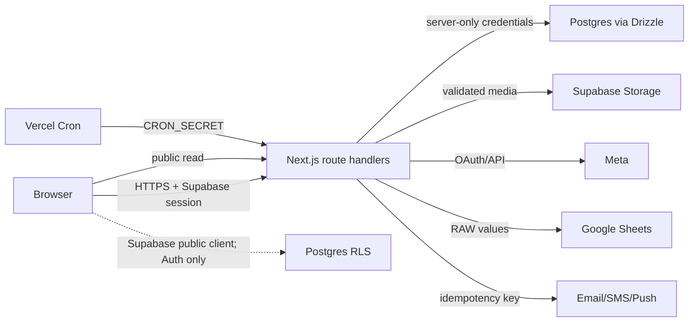

# 시스템 아키텍처와 신뢰 경계

## 구성 요소

| 계층 | 구성 | 보안 책임 |
| --- | --- | --- |
| Browser | Next.js UI, TipTap editor, service worker | 동일 출처 요청, 안전한 렌더링, push endpoint 입력 |
| Edge/App | Next.js App Router, route handlers, server layouts | 인증/권한, body 제한, 입력 검증, cache/header 정책 |
| Domain/DB | `src/lib/**`, Drizzle, `postgres` | 테넌트 scope, transaction, 상태 전이, idempotency |
| Identity | Supabase Auth | 서명된 사용자 ID와 확인된 이메일의 권위 원천 |
| Data | Supabase Postgres/RLS, Storage | 행 및 object 접근 경계, 공개/비공개 수명주기 |
| Jobs | Vercel Cron | secret 검증, 중복 실행 방지, 재시도 안전성 |
| External | Meta, Google Sheets, email/SMS, web-push, RSS | SSRF 경계, timeout, 오류 축약, 공급자 중복 처리 |

## 주요 데이터 흐름

## 역할 모델

- `guest`: 공개 catalog/매거진/게시판 조회와 제한된 공개 문의 작성
- `user`: 본인 profile, 신청, 후기, 알림, 문의 접근
- `host/partner`: membership으로 연결된 village와 그 하위 program/form/application/report 관리
- `admin`: 서버에서 `requireAdminRole`을 통과한 전체 관리 기능
- service role/server DB: 사용자 요청을 대신해 최소한의 서버 로직을 수행하며 모든 객체 ID를 다시 scope 처리해야 함

## 신뢰 경계

1. Browser -> Next API: 모든 header, JSON, multipart, URL, object ID는 비신뢰 입력이다.
2. Browser -> Supabase: public key를 가진 공격자가 임의 SQL REST 호출을 만들 수 있으므로 grant와 RLS가 최종 경계다.
3. Next API -> Postgres: service credential 사용 시 RLS만 믿지 않고 route와 query 모두 tenant scope를 강제한다.
4. Next API -> Storage: MIME header와 파일명은 비신뢰이며 decode/container 검증 후 random object key로 저장한다.
5. Next API -> External URL: redirect, DNS, credential, port, private network를 고려한다.
6. Stored content -> Browser DOM: 저장된 HTML/JSON/URL은 과거 데이터까지 다시 sanitize한 후 렌더링한다.
7. Cron/provider retry -> Domain state: 같은 이벤트가 여러 번 도착해도 단일 효과가 되도록 lock, 조건부 update, idempotency key가 필요하다.

## 민감 데이터

- 인증 식별자와 이메일, 전화번호, 주소
- 프로그램 신청 답변, 문의/메시지, 후기와 moderation 기록
- host membership과 admin role
- Supabase service role/DB URL, Cron secret, VAPID, OAuth token, service account credential

민감 값은 이번 산출물에 복사하지 않았으며 위치와 형식만 점검했다.

## 보안상 중요한 구현 경로

- 인증/공통 방어: `src/lib/api-security.ts`, `src/lib/auth-email.ts`, `src/lib/local-dev-auth.ts`
- host scope: `src/lib/host-village-access.ts`, `src/lib/village-db.ts`, `src/lib/report-automation-db.ts`
- 신청/후기: `src/lib/host-application-db.ts`, `src/lib/review-db.ts`
- upload: `src/lib/image-upload-security.ts`와 각 `*-assets`/avatar/review-image route
- HTML/URL: `src/lib/magazine-content.ts`, `src/lib/magazine-admin-input.ts`, `src/lib/url-security.ts`, `src/lib/village-page-cms.ts`
- DB 최종 경계: `supabase/migrations/20260711000000_lock_browser_data_writes.sql` 외 신규 migration 2개
